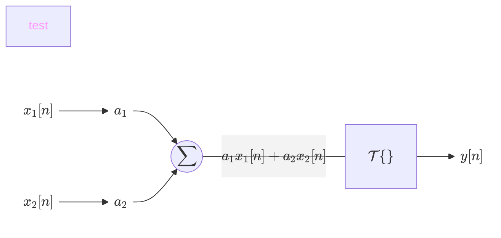
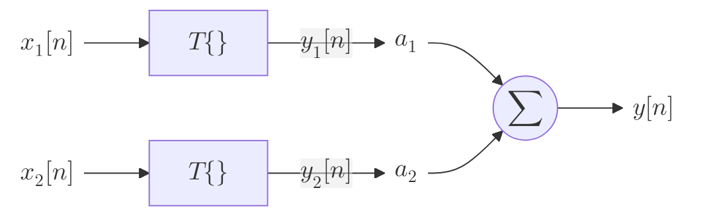

Čtvrté cvičení z předmětu [[./index|BPC-CZS]]

## Vlastnosti systémů a konvoluce

1. [[CZS cvičení č.4#Klíčové pojmy|Klíčové pojmy]]
2. [[CZS cvičení č.4#Zjištění linearity systému|Zjištění linearity systému]]
3. [[CZS cvičení č.4#Diskrétní lineární konvoluce|Diskrétní lineární konvoluce]]
4. [[CZS cvičení č.4#Samostatné úkoly|Samostatné úkoly]]
	1. [[CZS cvičení č.4#Linearita|Linearita]]
	2. [[CZS cvičení č.4#Časová variance|Časová variance]]
	3. [[CZS cvičení č.4#Kauzalita|Kauzalita]]

### Klíčové pojmy

- **Linearita systémů**
- **Časová invariance/variance**
	- zda se systém změní při posunutí časové osy
- **Kauzalita**
	- zda systém závisí i na budoucích vzorcích systému
- **Stabilita systému**
	- póly uvnitř jednotkové kružnice
	- omezený vstup -> omezený výstup
- **Lineární diskrétní konvoluce**
	- představuje odezvu LTI (Lineárně časově invariantní) systému na vstupní signál
- **Korelace** (křížová korelace a autokorelace)
	- podobnost dvou signálů nebo časově posunuté verze stejného signálu

### Zjištění linearity systému

### Diskrétní lineární konvoluce

- Definice:

	$$y = x * h$$

	$$y[m] = \sum^\infty_{n=-\infty} x[n] \cdot h[m - n]$$

- pokud vstupní signál $x$ bude mít délku $N$ a impulsní charakteristika $h$ délku $M$, pak výstupní signál bude mít délku $N + M − 1$
- Matlab funkce:
	- `y = conv(x, h)`
	- `Y = conv2(X, H)`

### Samostatné úkoly

#### Linearita

#### Časová variance

#### Kauzalita

